# Arquitectura general de SecureBrowser Platform

## Estado

Este documento describe la arquitectura prevista para el MVP del TFG.

## Diagrama general

[Fuente editable del diagrama (Mermaid)](../../diagrams/architecture-overview.mmd).

## Desktop

Aplicación de navegación en C++ con Chromium Embedded Framework (CEF).

- Aplica las políticas de filtrado de URL y control de descargas.
- Registra eventos de seguridad.
- Utiliza SQLite para persistencia local y eventos pendientes de sincronización.
- Genera un identificador único por evento para evitar duplicados al sincronizar.

## Backend

API en Java con Spring Boot y PostgreSQL.

- Gestiona autenticación, compañías y usuarios.
- Gestiona licencias, tokens de enrollment y dispositivos.
- Gestiona políticas y eventos de seguridad.
- Limita la administración de cada ADMIN a su compañía.

La [organización interna del backend](backend-structure.md) define los paquetes
por funcionalidad, sus responsabilidades y la ubicación de las pruebas, conforme
al [ADR-0007](../adr/0007-backend-package-organization.md).

El [diseño de autenticación JWT](jwt-authentication.md) recoge el flujo de login,
la renovación automática, el tratamiento de contraseñas y la validación de
peticiones, conforme al
[ADR-0008](../adr/0008-jwt-authentication.md).

La [autorización por Company](company-authorization.md) define los permisos de
ADMIN y USER, la propiedad de los recursos y el aislamiento entre compañías,
conforme al [ADR-0009](../adr/0009-company-authorization.md).

Los [contratos iniciales de la API REST](rest-api-contracts.md) definen las rutas,
DTOs, respuestas y errores para Desktop y Android, conforme al
[ADR-0010](../adr/0010-rest-api-contracts.md).

## Android

Aplicación en Kotlin con Jetpack Compose y arquitectura MVVM.

- Permite administrar y monitorizar la plataforma.
- Incluye pantallas de dispositivos, eventos y políticas.
- Se comunica con la API del backend mediante Retrofit.

## Decisiones pendientes

La tecnología de interfaz desktop se decidirá tras un prototipo técnico
que permita comparar Qt 6 Widgets y CEF Views.

Las decisiones arquitectónicas relevantes se documentarán mediante ADR
en `docs/adr/`.
